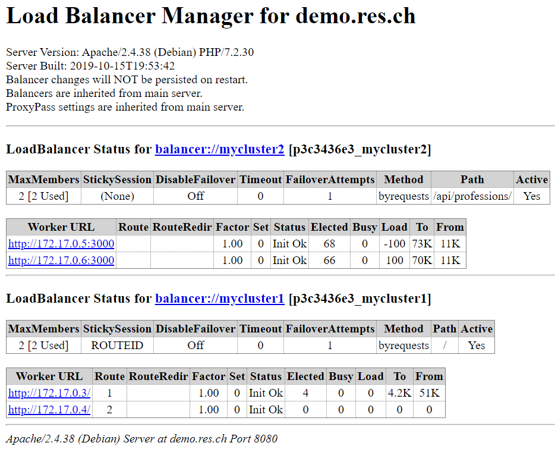
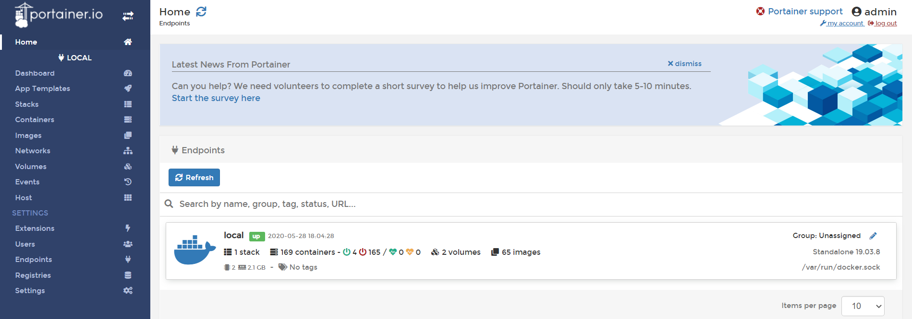
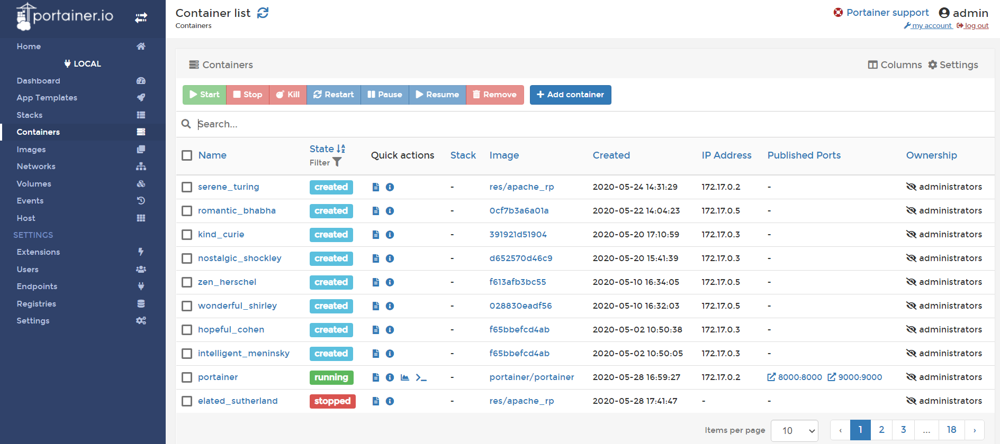
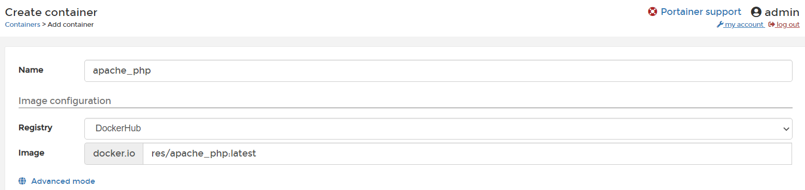
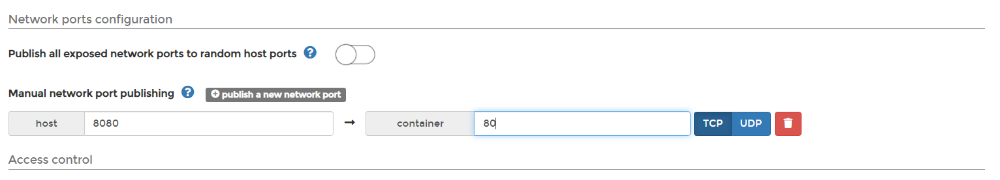
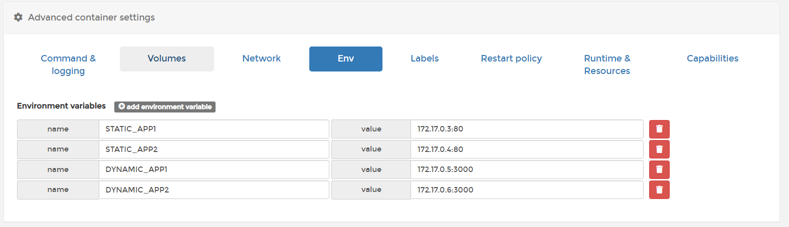

# HEIGVD-RES-2020-Labo-HTTPInfra

Les objectifs du laboratoire sont détaillés [ici](https://github.com/SoftEng-HEIGVD/Teaching-HEIGVD-RES-2020-Labo-HTTPInfra).

Remarques : 

Toutes les manipulations suivantes ont été réalisées sous un environnement Windows.

Les manipulations concernant docker ont été effectués à l'aide de "Docker Desktop on Windows".
 
## Étape 1 (fb-apache-static)

Le but de cette étape est de créer un serveur apache httpd "dockerisé" servant du contenu statique.

### Installer un serveur apache httpd et préparer une image docker qui va l'encapsuler 
Dans un premier temps, j'ai créé le fichier "Dockerfile" (qui représentera la recette de configuration de l'image).

#### Dockerfile 

```
FROM php:7.2-apache

COPY src/ /var/www/html/
```

La première instruction permet d'alléger la configuration de l'image en récupérant une déjà préconfigurée (ici une image php avec un serveur HTTP apache configuré)

La deuxième, copie notre dossier "src" local dans le dossier var/www/html de l'image (Cet emplacement peut-être modifié au travers de son fichier de configuration).
 
Il y a donc 2 endroits principaux dans le serveur apache :

/var/ : Contenu de la page web

/etc/apache2/ : Contient les différents fichiers de configurations


### Ajouter du contenu HTML basique

Il faut créer un dossier du même nom que le dossier qui doit copié (ici src), au même niveau que le fichier Dockerfile et y placer du contenu.

J'ai donc créé un fichier index.html et afin d'améliorer l'aspect visuel j'ai récupéré un template de code mis à disposition par bootstrap pour avoir une page web présentable.

### Construction et exécution de l'image

##### Pour créer l'image 
```
docker build -t res/apache_php .
```
L'image crée se nomme "res/apache" 

le symbole "." signifie que l'on a va utiliser le répertoire courant comme contexte à la création de l'image.

##### Exécuter le containeur docker avec l'image crée précédémment :
```
docker run -p 9090:80 res/apache_php // mode interactive
docker run -d -p 9090:80 res/apache_php // en arrière-plan
```

### Vérification 

##### CMD :
```
telnet localhost 9090
```

##### Navigateur : http://localhost:9090/

## Étape 2 (fb-exress-dynamic)
Le but de cette étape est de créer une application web dynamique simple.

### Écrire une application Node.js qui va retourner des données JSON à la suite de requêtes GET

#### Dockerfile 
```
FROM node:12.16

COPY src /opt/app

CMD ["node", "/opt/app/index.js"]
```
Node.js est utilisé pour transmettre du contenu JSON dynamiquement.

La troisième instruction lance le script index.js au lancement d'un container sur la base de cette image.

#### Démarrer une application node js 
```
npm init
```
Cette commande va créer le fichier "package.json".

#### Installer le module "chance" (Pour générer des valeurs aléatoires)  et le framework "express" pour simplifier le code à écrire 
```
npm install --save chance
npm install --save express
```
Cela crée le package node_modules et enregistre les dépendances dans le fichier package.json

#### Script index.js (Contient le code à exécuter au lancement) 

````
var Chance = require('chance');
var chance = new Chance();

var express = require('express');
var app = express();
````
Chargement des modules

Il faut respecter la case sur Windows sinon erreur au lancement du container !
````
app.get('/', function(req,res) {
	res.send( generateProfessions() );
});
````
Renvoie le résultat de la fonction generateProfessions lorsqu'on se connect sur http://localhost:3000/
````
app.listen(3000, function () {
	console.log('Accepting HTTP requets on port 3000');
});
````
On se met à l'écoute sur le port 3000.

### Vérification 
Créer l'image et lancer le container
````
docker build -t res/express_professions .
docker run -p 9090:3000 res/express_professions 
````

##### CMD :
````
telnet localhost 3000
GET / HTTP/1.0 [\r\n]
````
Ne pas oublier le retour à la ligne !

##### Navigateur :  http://localhost:3000/

## Étape 3 (fb-apache-reverse-proxy)

### Configurer un reverse proxy apache dans docker

#### Dockerfile 
````
FROM php:7.2-apache

COPY conf/ /etc/apache2

RUN a2enmod proxy proxy_http
RUN a2ensite 000-* 001-*
````

La commande copy n'écrase pas le contenu de Apache2  mais complète par nos fichiers.

a2enmod  : Permet d'activer des modules supplémentaires d'apache (ex mode proxy)

a2ensite : permet d'activer les virtual hosts configurés dans le dossier sites-available (Cela permet au serveur apache de servir plusieurs sites logiques)

Dossier conf : Contient le répertoire "sites-available" qui lui contient les fichiers de configuration des sites


##### sites-available 
000-default.conf :

````
<VirtualHost *:80>
</VirtualHost>
````
Nécessaire au bon fonctionnement du reverse proxy. Sinon le virtual host du fichier 001-reverse-proxy.conf serait celui par défaut et
on pourrait aux accéder aux ressources de ce virtual host sans avoir à préciser le ServerName.

001-reverse-proxy.conf :
````
<VirtualHost *:80>
	ServerName demo.res.ch
	
	#ErrorLog $[APACHE_LOG_DIR]/error.log
	#CustomLog $[APACHE_LOG_DIR]/access.log combined
	
	ProxyPass "/api/professions/" "http://172.17.0.3:3000/"
	ProxyPassReverse "/api/professions/" "http://172.17.0.3:3000/"
	
	ProxyPass "/" "http://172.17.0.2:80/"
	ProxyPassReverse "/" "http://172.17.0.2:80/"
</VirtualHost>
````

Notre container construit avec l'image "res/apache_rp" aura pour rôle d'être un reverse serveur proxy et sera donc en charge de nous rediriger
sur les containers servant du contenu statique ou dynamique en fonction de l'url. 

ATTENTION : Ici les adresses des containers à atteindre sont stockées en dur. C'est-à-dire qu'il faut s'assurer qu'au lancement du reverse proxy
que ces 2 containeurs aient les mêmes addesses que ci-dessus. C'est donc une solution très fragile !

##### Lancement des services et du reverse serveur proxy  
````
docker build -t res/apache_php .
docker build -t res/express_professions .
docker build -t res/apache_rp .
````
Chaque instruction est à exécuter dans le bon répertoire.
````
docker run -d --name apache_static res/apache_php
docker run -d --name express_dynamic res/express_professions
docker run -d -p 8080:80 --name apache_rp res/apache_rp
````

### Vérification 
Les ressources des containers apache_static et express_dynamic ne sont donc pas accessibles directement. (Pas de port mapping sur ces containers).
Il est nécessaire de passer par le reverse proxy. (Port mapping sur 8080)

##### CMD :

````
telnet localhost 8080
GET / HTTP/1.0[\r\n] // ou GET /api/professions/ HTTP/1.0[\r\n]
Host: demo.res.ch
````

##### Navigateur :

Si on tente de se connecter sur localhost:8080 -> redirection sur le site par défaut

C'est parce que le navigateur doit envoyer l'en-tête "host". Pour ce faire, il faut modifier le fichier hosts de Windows en ajoutant l'instruction suivante :

````
127.0.0.1       demo.res.ch
````
Ainsi on sera redirigé sur l'adresse du localhost lorsqu'on tentera d'atteindre demo.res.ch (résolution dns)

urls accessibles :
````
http://demo.res.ch:8080/
http://demo.res.ch:8080/api/professions/
````

## Étape 4 (fb-ajax-jquery)


Dans les dockerfiles des 3 images, ajouter les instructions suivantes pour installer vi :

````
apt-get update // mettre à jour la liste des packetage
ap-get install -y vim // installer vim
````
Pour tester :
````
docker run -it res/apache_php /bin/bash
touch toto
vi toto
````

#### Implémenter une requête ajax avec jquery (library javascript)

professions.js (docker-images/apache-php-image/src/js) :

Le but du code suivant est de périodiquement  récupérer et mettre à jour la page 
avec les données reçues au travers de requêtes AJAX.
````
$(function() {
	console.log("loading professions");
	
	function loadProfessions() {
		$.getJSON("/api/professions/", function (professions) {
			console.log(professions);
			message = "My job : " + professions[0].profession;
			$(".skills").text(message);
		});
	};
	loadProfessions();
	setInterval(loadProfessions, 2000);
});
````

index.html (docker-images/apache-php-image/src) :

Ajouter :
````
<! -- Custom script to load professions -->
<script src="js/professions.js></script>
````

### Vérification 

Lancer les 3 containers :

ATTENTION : Ne pas oublier avant de faire un npm install puis reconstruire l'image express_professions (Car il manque le dossier nodes_modules).
````
docker run -d --name apache_static res/apache_php
docker run -d --name express_dynamic res/express_professions
docker run -d -p 8080:80 --name apache_rp res/apache_rp
````
Et se connecter sur le reverse proxy : http://demo.res.ch:8080/

## Étape 5 (fb-dynamic-configuration)

On va modifier l'implémentation des adresses IPs hard-codées pour la rendre dynamique.
L'objectif est de pouvoir fournir ces informations au travers de variables d'environnements (grâce au flag -e) lors de la création du docker apache_rp.

#### Configuration dynamique du reverse proxy

Les valeurs qui seront saisies seront utilisées dans notre fichier de configuration.
Afin de générer ce fichier on va utiliser php comme un moteur de template.

Pour ce faire, on va devoir lancer un script lors du lancement d'un container.

apache2-foreground est un fichier appelé lors de la création de notre image php (7.2)
On va donc l'overwrite pour faire executer notre script.

Création de se fichier en se basant sur l'existant : https://github.com/docker-library/php/tree/master/7.2

Il est nécessaire d'appliquer l'instruction suivante pour rendre ce fichier exécutable.
````
chmod 755 apache2-foreground 
````

##### Ajouter au  Dockerfile : 
````
COPY apache2-foreground /usr/local/bin/
````

Après reconstruction de cette image et lancement d'un container j'avais le problème suivant :

Cela était dû à un problème de format à cause de caractères de fin de ligne Windows (^M) .
Cette erreur a été résolue en convertissant ce fichier en format UNIX LF à l'aide de notepad ++


#### Création du fichier config-template.php dans le dossier "templates" 
````
<?php
$dynamic_app = getenv('DYNAMIC_APP');
$static_app = getenv('STATIC_APP');
?>

<VirtualHost *:80>
	ServerName demo.res.ch
	
	ProxyPass '/api/professions/' 'http://<?php print "$dynamic_app"?>/'
	ProxyPassReverse '/api/professions/' 'http://<?php print "$dynamic_app"?>/'
	
	ProxyPass '/' 'http://<?php print "$static_app"?>/'
	ProxyPassReverse '/' 'http://<?php print "$static_app"?>/'
</VirtualHost>
````
Le but de ce fichier est de récupérer les variables d'environnements afin de configurer dynamiquement les adresses IPs des containers à atteindre
par le reverse proxy.

##### Ajouter au Dockerfile :
````
COPY templates /var/apache2/templates
````

Vérifier que la copie a bien eu lieu : 
````
docker run -it res/apache_rp /bin/bash
cd /var/apache2/templates
ls
exit
````

Dans le fichier apache2-forground, écrire notre script :
````
echo "Dynamic app URL: $DYNAMIC_APP"
php /var/apache2/templates/config-template.php > /etc/apache2/sites-available/001-reverse-proxy.conf
````
Ce script aura pour effet de remplacer le contenu du fichier "001-reverse-proxy.conf" par celui de notre fichier "config-templates.php".


#### Vérification

Lancement des containers apache_static, express_dynamic
Exécuter l'instruction suivante :
````
docker run -d -e STATIC_APP=172.17.0.X:80 -e DYNAMIC_APP=172.17.0.Y:3000 -p 8080:80 res/apache_rp
````

## Load balancing: multiple server nodes (fb-lb-multiple-server)

Pour le load balancing, j'ai opté pour le module Apache : [mod_proxy_balancer](https://httpd.apache.org/docs/2.4/fr/mod/mod_proxy_balancer.html)

J'ai principalement modifié le fichier config-template.php et le dockerfile.

#### config-template.php 
````
<?php
$static_app1 = getenv('STATIC_APP1');
$static_app2 = getenv('STATIC_APP2');
$dynamic_app1 = getenv('DYNAMIC_APP1');
$dynamic_app2 = getenv('DYNAMIC_APP2');
?>
````
J'ai étendu les variables d'environnements pour avoir un serveur statique et dynamique en plus servi par le reverse
proxy.
Cette solution n'étant pas idéale, mais suffisante pour montrer le fonctionemment du load balancing.

````
<VirtualHost *:80>	
	<Location "/balancer-manager/">
		SetHandler balancer-manager
		Require all granted
	</Location>
	ProxyPass /balancer-manager !

    ...

</VirtualHost>
````
Activation du support du gestionnaire de répartiteur. Cela permet d'avoir sur http://demo.res.ch:8080/balancer-manager/
une interface qui permet la mise à jour dynamique des membres du groupe de répartition de charge et dans notre cas, 
pour pouvoir afficher des informations utiles sur le load balancing.

````
<VirtualHost *:80>

       ...

	<Proxy "balancer://mycluster2">
    BalancerMember 'http://<?php print "$dynamic_app1"?>'
	BalancerMember 'http://<?php print "$dynamic_app2"?>'

    ProxySet lbmethod=byrequests
	</Proxy>
	
	ProxyPass        "/api/professions/" "balancer://mycluster2"
	ProxyPassReverse "/api/professions/" "balancer://mycluster2"
	
	<Proxy "balancer://mycluster1/">
    BalancerMember 'http://<?php print "$static_app1"?>/'
	BalancerMember 'http://<?php print "$static_app2"?>/'

    ProxySet lbmethod=byrequests
	</Proxy>
	
	ProxyPass        "/" "balancer://mycluster1/"
	ProxyPassReverse "/" "balancer://mycluster1/"
	
</VirtualHost>
````
Au travers des balises "Proxy" et d'un attribut "balancer://...", on peut spécifier les membres d'un cluster à atteindre

Depuis "/" : Les serveurs du cluster "mycluster1"

Depuis "/api/pofessions" : Les serveurs du cluster : "mycluster2"

L'algorithme de planification de la répartition de charge utilisée est : byrequests qui correspond à l'algorithme "round robin"

#### Dockerfile 
````
...

RUN a2enmod proxy proxy_http proxy_balancer lbmethod_byrequests status

...

````
On ajoute donc 3 modules supplémentaires :
proxy_balancer : Pour le load balancing

lbmethod_byrequests : L'algorithme de planification de charge

status : Nécessaire pour le manager balancer

#### Professions.js
J'ai modifié ce fichier afin le json renvoyé contienne l'adresse IP du serveur qui l'a généré. 

### Vérification 
Il faut lancer 2 serveurs statiques et dynamiques. Récupérer les adresses Ips pour l'utiliser dans le script suivant :

````
docker run -d -e STATIC_APP1=172.17.0.W:80 -e STATIC_APP2=172.17.0.X:80 -e DYNAMIC_APP1=172.17.0.Y:3000 -e DYNAMIC_APP2=172.17.0.Z:3000 -p 8080:80 res/apache_rp
````

Puis se connecter sur : http://demo.res.ch:8080/

La page web affiche le contenu généré aléatoirement ainsi que l'adresse du serveur qui le génère.


## Load balancing: round-robin vs sticky sessions (fb-lb-RR-SS)

Comme pour l'étape précédente, il a fallu modifier le fichier config-template.php et dockerfile.

#### config-template.php 
````
...

	Header add Set-Cookie "ROUTEID=.%{BALANCER_WORKER_ROUTE}e; path=/" env=BALANCER_ROUTE_CHANGED
	<Proxy "balancer://mycluster1/">
    BalancerMember 'http://<?php print "$static_app1"?>/' route=1
	BalancerMember 'http://<?php print "$static_app2"?>/' route=2
	
	ProxySet stickysession=ROUTEID
	</Proxy>
	
	ProxyPass        "/" "balancer://mycluster1/"
	ProxyPassReverse "/" "balancer://mycluster1/"
````

Les serveurs dynamiques devant distribuer des requêtes HTTP de manière "round robin", rien n'a été modifié par rapport à l'étape précédente.

Pour les serveurs statiques il a fallu rajouter les paramètres indiqués ci-dessus.

#### Dockerfile 
````
...
RUN a2enmod proxy proxy_http proxy_balancer lbmethod_byrequests status headers
...
Rajout du modèle headers

````

### Vérification 
Lancer les containers selon les indications de l'étape précédente.

Pour les serveurs dynamiques :
Comme à l'étape précédente. On s'attend que l'adresse IP du serveur change car il n'y pas de notion de "stickyness".

Pour les serveurs statiques :
Se connecter http://demo.res.ch:8080/balancer-manager/ :
 
 
On constate que seul le premier serveur statique sert la page web, peu importe le nombre
de fois que l'on actualise.

## Dynamic cluster management 
Cette étape n'a pas été réalisée !

## Management UI (Pas de branche)

Pour l'interface graphique, j'ai opté pour [portainer](https://www.portainer.io/)

#### Procédure d'installation 

````
docker volume create portainer_data
docker run -d -p 8000:8000 -p 9000:9000 --name=portainer
--restart=always -v /var/run/docker.sock:/var/run/docker.sock -v portainer_data:/data portainer/portainer
````
Se connecter sur http://localhost:9000/

#### Au premier lancement il faut :

* Créer un compte admin

* Choisir l'option pour manager l'environnement docker en local, puis cliquer sur le bouton connect


#### Procédure pour lancer la dernière étape du laboratoire réalisée "Load balancing: round-robin vs sticky sessions " :

Lors de la connection on arrive sur cette page :



Cliquez sur l'endpoint "local" puis sur "container" dans l'onglet à gauche :



À partir de là, on peut démarrer nos containers ou en créer en cliquant sur l'option "Add container"



Il faut donc créer 2 serveurs statiques, 2 serveurs dynamiques.

Les adresses IPs sont montrées sur la page des containers. Cela est utile pour compléter pour les variables d'environnement.


#### Création du reverse proxy :
##### Comme montré précédémment, et en plus ajouter les paramètres suivants :
Configuration du port mapping :



Configuration des variables d'environnements :



### Vérification 
sur : http://demo.res.ch:8080/


